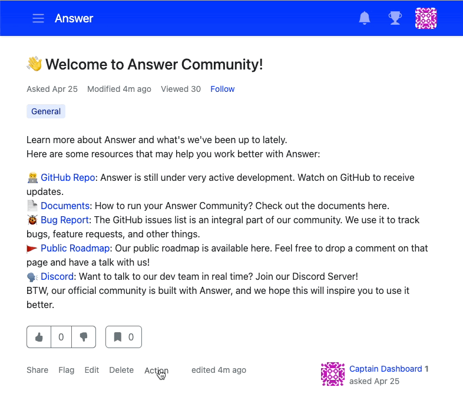
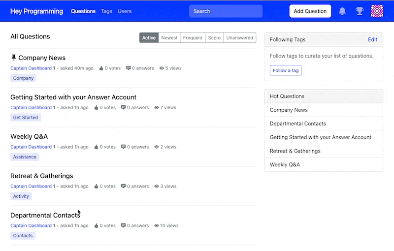

最新版本的答案有新的调整、改进和优化。 仔细看看你如何能够用 Answer v1. 来有效地管理问题。

## 有哪些新特性？
为您的 Q&A 平台设置一个重要或经常问到的问题，以便它始终保持在您社区的顶部。 

取消置顶一个问题以使它无法被看到以进行暂时修改或进一步审查。 管理员可以在管理后台中再次列出问题.管理后台>内容\>问题。 

Pind 和 Unlist帮助你自己的知识社区裁剪，同时维持和组织知识系统可能很容易。

## Bug 修复了 & 优化
我们还做了一些调整来修复标签、评论表单和顽固删除的问题。 我们还通过最优化的翻译来消除上下文模糊不清。

我们强烈建议您构建和管理一个 Q&一个平台 [答案 v1.0.9](https://github.com/answerdev/answer/releases/tag/v1.0.9) 您总是欢迎在 [https://meta.answer.dev/](https://meta.answer.dev/) 中贡献您的想法(功能请求，或者寻找一个but)。 那么你会先置顶什么？